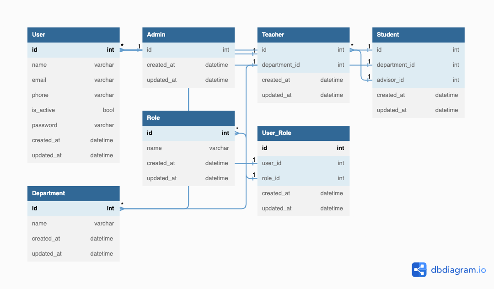

# EduConnect

EduConnect is a web application that connects teachers and students in a school setting. The application allows teachers
to manage their students as advisors and students to request a teacher to be their advisor. The application also
includes an admin panel for managing teachers and students.

The **ER Diagram** may make more sense



### Getting Started

To run this application locally, you will need to have the following installed:

    - Java 17
    - PostgresSQL

1. Clone the repository

    ```bash
    git clone https://github.com/zahidhasanpapon/edu-connect.git
    ```

2. Set up the Database

    - Create a database named edu_connect.
    - Update the application.yml file with your database credentials.
    -
3. Start the Backend Server

    - Open a terminal window and navigate to the root folder of the project.
    - Run the following command to start the backend server:

    ```agsl
    ./mvnw spring-boot:run
    ```

### Functionality

#### Admin

    - View all teachers and students
    - Add roles to teachers and students
    - Deactivate teachers and students accounts
    - Default admin account is created

#### Teacher

    - View and edit own profile
    - Reset password
    - Accept or dismiss student requests
    - View profiles of all advisees
    - Remove student from advisee list

#### Student

    - View and edit own profile
    - Reset password
    - Request teacher to be advisor
    - One student can only have one teacher as advisor

#### Security

    - Passwords are hashed using a simple hashing implementation from Spring Boot.
    - Authentication is done using OAuth 2.0 (JWT token-based). Access tokens are sent upon successful login and used to access features based on user roles.

### **API Structure**

We are allowing a few endpoints to perform actions

##### **Admin**

* `GET /api/v1/teachers` - Retrieve a list of all teachers
* `GET /api/v1/students` - Retrieve a list of all students
* `POST /api/v1/teachers/{id}/roles` - Add a role to a teacher
* `POST /api/v1/students/{id}/roles` - Add a role to a student
* `PATCH /api/v1/teachers/{id}/deactivate` - Deactivate a teacher account
* `PATCH /api/v1/students/{id}/deactivate` - Deactivate a student account

##### **Teacher**

* `GET /api/v1/teachers/{id}/profile` - Retrieve the profile of a teacher
* `PUT /api/v1/teachers/{id}/profile` - Update the profile of a teacher
* `PUT /api/v1/teachers/{id}/password` - Reset the password of a teacher
* `GET /api/v1/teachers/{id}/advisees` - Retrieve a list of all advisees of a teacher
* `PATCH /api/v1/teachers/{id}/advisees/{id}` - Remove a student from the advisee list of a teacher
* `GET /api/v1/teachers/{id}/requests` - Retrieve a list of all student requests for a teacher
* `POST /api/v1/teachers/{id}/requests/{id}` - Accept a student request for a teacher
* `DELETE /api/v1/teachers/{id}/requests/{id}` - Dismiss a student request for a teacher

##### **Student**

* `GET /api/v1/students/{id}/profile` - Retrieve the profile of a student
* `PUT /api/v1/students/{id}/profile` - Update the profile of a student
* `PUT /api/v1/students/{id}/password` - Reset the password of a student
* `POST /api/v1/students/{id}/requests` - Request a teacher to be an advisor
* `GET /api/v1/students/{id}/advisor` - Retrieve the advisor of a student
